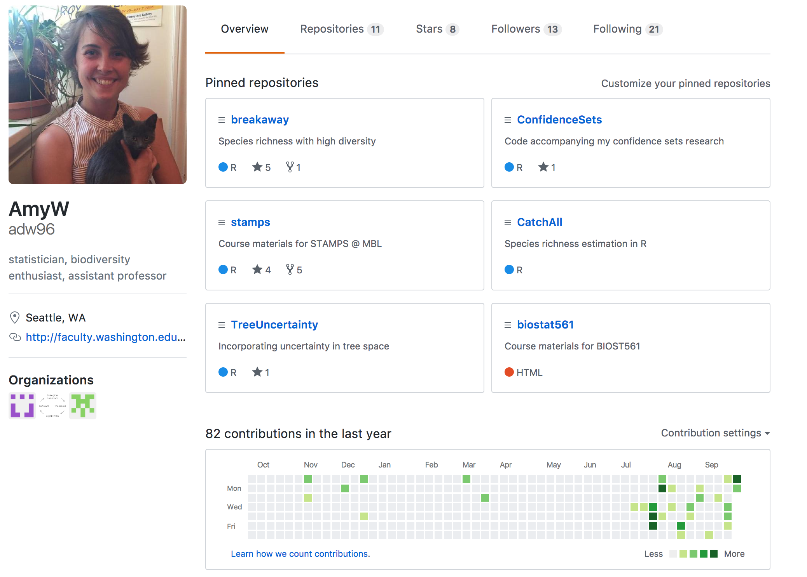
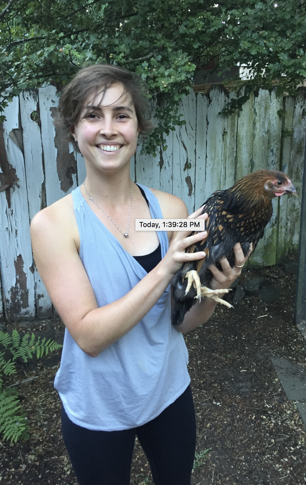
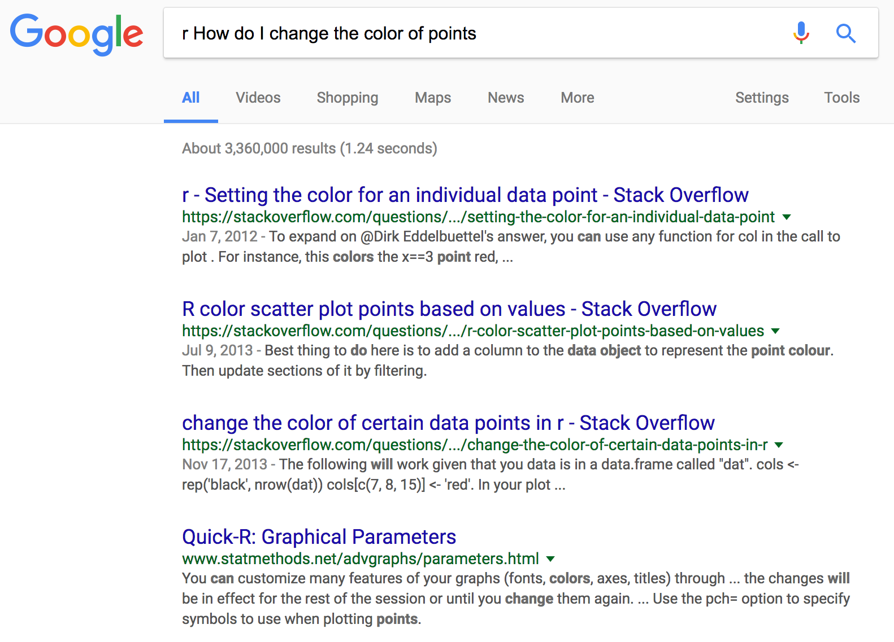
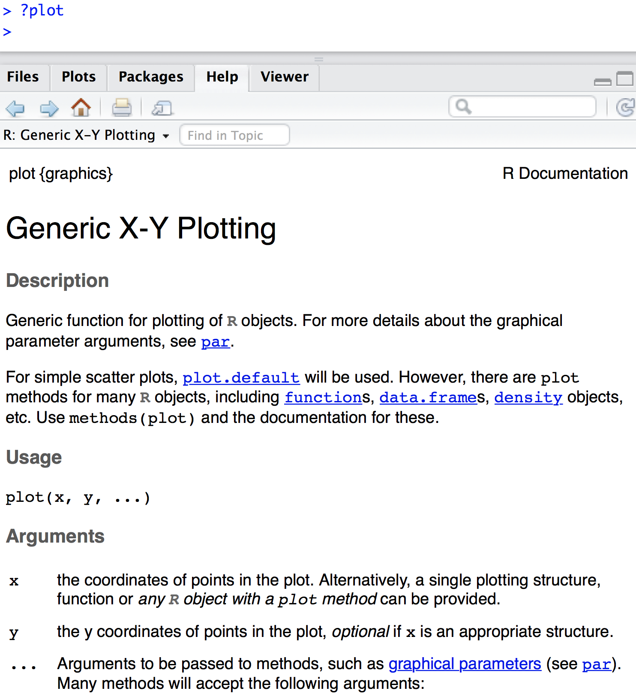
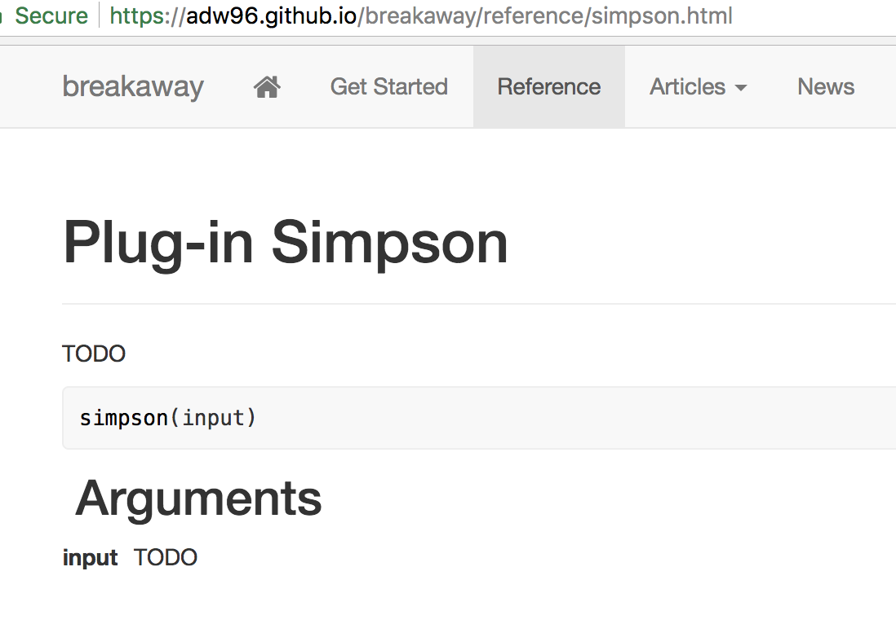
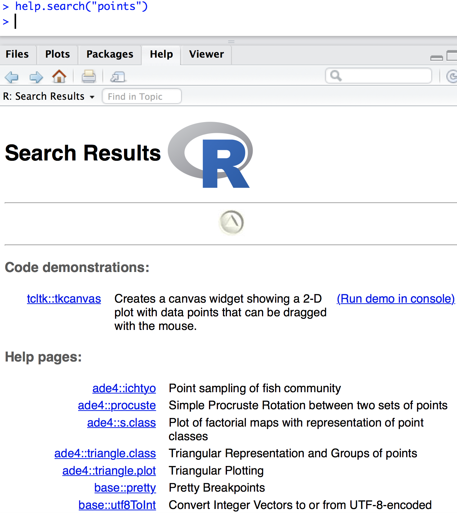

```{r setup, include=FALSE}
knitr::opts_chunk$set(echo = TRUE, size = "footnotesize")
```

# Welcome!

- Biost 561 is an add-on to Biost 514
- 514 covers basic R commands, 561 covers more advanced R and other programming skills
- As a MS/PhD student in Biostats, you will do some serious programming!
- Good programming practices will help you with research, collaborating, your job search, and your long-term career... whichever path you choose!

# Structure and expectations

- Weekly lectures
- Weekly homeworks
- Weekly office hours: HSB F-657. Tuesday 3-4? 
- Office hours by appointment

Public folder of course materials at 
<https://github.com/adw96/biostat561>


# Topics

Subject to change

- 9/28 Lecture 1: Advanced classes, methods, objects, debugging
- 10/5 Lecture 2: Efficient loops, functions
- 10/12 Lecture 3: Pipes
- 10/19 Lecture 4: ggplot
- 10/26 Lecture 5: latex *
- 11/2 Lecture 6: Markdown *
- 11/9 Lecture 7: unix, shell, UW cluster computing *
- 11/16 Lecture 8: version control, git, github, packages
- 11/23 no class; Thanksgiving
- 11/30 Lecture 9: Calling C/C++ in R *
- 12/7 Lecture 10: Python *


\* indicates guest lecture by one of your classmates. A great opportunity to learn the latest and greatest!

# Resources

- Available via github <https://github.com/adw96/biostat561>
    * Syllabus
    * Slides (& source code)
    * Examples
    * Homeworks
- Available via github classroom
    * Homework submission
- Available via email
    * Announcements

# Expectations

What you should expect of me

- I will make your learning a priority
- I will give you timely feedback on your homeworks
- I will treat you as adults, I will treat you with respect
- I will talk slowly (tell me if I'm speaking too fast!)
- I will try to make class engaging and fun!

# Expectations

What I will expect of you

- You make attending class a priority
- You submit your best work for homework: your own work, on time
- You engage in classroom discussion and quizzes!
- You learn from the class; you learn to teach yourself programming skills
- You treat me, guest lecturers, and each other with respect

# Assessment

The only assessment in this course is homework.

- 10 or fewer homeworks
- You must submit a good attempt at every homework to receive credit for this course

I won't record attendance, but if you consistently do not show up you will not receive credit.

# About me

{width=300px} {width=150px}

# About you

Everyone is here with different backgrounds in programming and computing. Let's get statistical!

[Analyse survey here]


# Class

There are many different *classes* of objects in R

```{r, echo = TRUE}
x <- c(1, 2, 5)
y <- c("a", "b")
z <- as.factor(y)
c(class(x), class(y), class(z), class(c))
```

Others include `logical` (`TRUE`, `FALSE`), complex numbers...

# Modes

R has different modes. The mode tells the way a variable is stored.

```{r, echo = TRUE}
mode(x)
mode(y)
mode(z) # factors are stored as numerics
mode(c)
```

# Modes

`is.[class]` asks about the class. Normally you will be interested in the class, not the mode.

```{r, echo = TRUE}
is.numeric(x)
is.factor(z)
is.numeric(z) # we asked about class, not the mode
```

# Data structures

R can store data in various *objects*

- vector: one-dimensional, all data points have same mode
- matrix: two-dimensional, all data points have same mode
- data frame: two-dimensional, all data points in same column have same mode
- list: one-dimensional, data points can be of any type

# Matrices

Matrices vs data frames: all elements have same mode in matrices

```{r, echo=TRUE}
cbind(c(1,2), c("a", "b"))
```

# Matrices

Be very careful with matrix operations!

```{r, echo=TRUE}
aa <- matrix(c(1, 2, 3, 5), nrow = 2, byrow = T)
bb <- c(0.5, 2)
aa
bb
```

# Matrices

```{r, echo=TRUE}
aa %*% bb # matrix multiplication
aa * bb # careful! pointwise
```

# Data frames

```{r, echo=TRUE}
data.frame(c(1,2), c("a", "b"))
dd <- data.frame("ID"=c(1,2), "name"=c("a", "b")) # better
dd
str(dd) # structure: compact info about frame & variables
```

# vectorisation

vectorisation: doing many calculations with a single command

```{r}
x <- c(0.5, 2, 3, 6)
x^2
y <- c(3, 1, 2, 1)
x^y 
```

# vectorisation

The slow way: with loops. Avoid where possible!

```
z <- rep(NA, 4)
for (i in 1:4) {
  z[i] <- x[i]^y[i] 
}
z
```

Code is easier to read, and usually easier to debug, when vectorised

# recycling

In many tasks, R recycles elements of one input until it has enough to match the other

\footnotesize
```{r}
aa
bb
aa + bb # vectors are treated as columns!
cc <- c(1, 2, 3, 4)
aa + cc # the silent killer
```

Be careful!

# Speed comparison
Vectorisation can cause major speed-ups, because task is optimised and precompiled in C/Fortran, not interpreted R.

```{r, eval=F, echo=T}
dd <- matrix(rnorm(1e6), nrow = 1000) 
cor(dd)

ee <- matrix(NA, 1000, 1000)
for (i in 1:1000) {
  for (j in 1:1000) {
    ee[i, j] <- cor(ee[, i], ee[, j])
  }
}
```
Speed up factor of vectorisation: 36!

# Lists

Lists store information of many different types. Names are optional, but recommended!


\footnotesize
```{r}
amy <- list(office.num = 657, pets = TRUE, 
            pets.names = c("Princess Jaws", "Friendly", "Mohawk",
                           "Canada", "USA", "Regina George"), 
            is.cat = c(TRUE, rep(FALSE, 5)))
amy
```

# Lists


Double square brackets pull out individual elements. Single square brackets pull out subsets of the list. I recommend using names wherever possible!

\footnotesize
```{r}
amy[[3]] # subset third element
amy[3] # third element -- a list!
```

# Lists

\footnotesize
```{r}
amy[2:3] # second and third elements -- a list!
amy$office # can also refer by name
```

# Generic functions

The same function can apply to objects of different classes. How does R know what to do?

\footnotesize
```{r, fig.width=3, fig.height=2.5}
c(class(log), class(trees))
layout(t(1:2), widths = c(3,1)); plot(log); plot(trees)
```

# Generic functions

`plot` is a *generic* function. Generic functions don't do anything themselves -- they call *methods*, which are tailored to the class.

```{r}
plot
methods("plot") # lists all types R knows how to plot
```

If no specialised method exists for that class, R will call `summary.default()`

# Generic functions

To find the functions that apply to a class

```{r}
methods(class = "lm")
```

# Generic functions

To see the code for a generic function, type `[function].[class]`

```{r}
dimnames.data.frame
```
  
# Help

There are many ways to get help with using functions or debugging code

1. The internet




# Help

2. `?fn` shows the documentation for `fn`... if it exists!



# Help

2. ... if it exists!



# Help

3. `help.search("topic")` searches help pages for "topic"




# Examples

The documentation pages often show examples (`example(plot)`) and have demos (`demo(plotmath)`). `vignette()` opens longer worked examples that are great for playing with new packages.


# Keep in mind

- The user of a function assumes responsibility for giving arguments in the correct form
- arguments are ordered
    * Unnamed arguments are allocated as first arguments
    * Named arguments can be anywhere in ordering
- Not supplied arguments assume default value
    * Not supplying arguments without a default gives an error message
    
Don't get bogged down in reading *all* the documentation -- experiment and learn from your mistakes instead!

# Debugging

1. Stare at it until you identify the problem a.k.a. psychic debugging
2. Breakdown the components until you find the problem (bisection method converges linearly!)
3. `traceback()` -- covered later in the course


# Homework 1 and next week

- Slides:
    * <https://github.com/adw96/biostat561/lecture1/lecture1.pdf>
- Homework 1 is due next Thursday at 2 p.m. 
    * <https://github.com/adw96/biostat561/lecture1/homework1.pdf>
- Complete Question 0 by next Tuesday so you can attend office hours if you have trouble
- Submission via github classroom (instructions included):
    * <https://classroom.github.com/classrooms/32249780-biost-561>